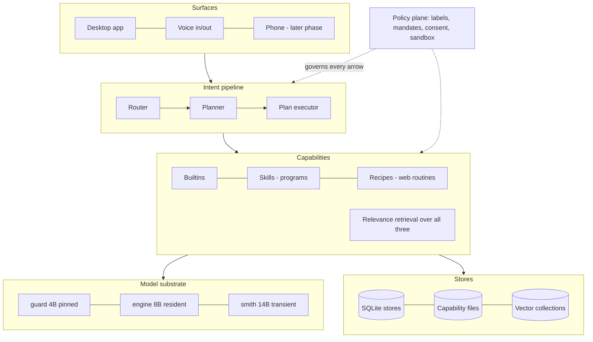
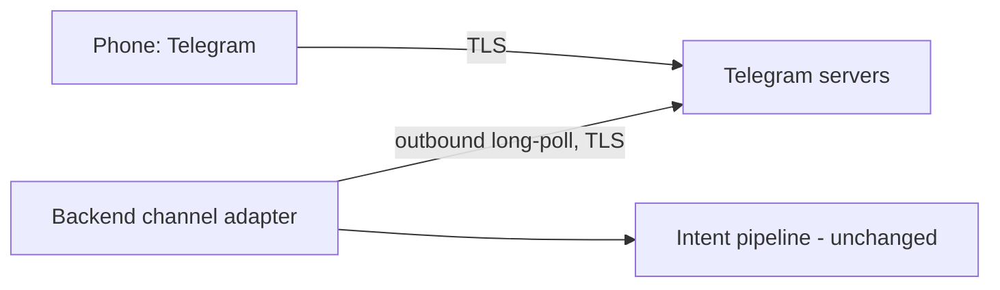

# Jarvis — System Architecture

**Status:** working design document; becomes Chapter 4 of the report and the
build reference for the roadmap phases. Companion to `requirements.md` (what)
and `roadmap.md` (when). This document says *how*.

## 0. The design principle

Every architectural decision below descends from one rule, learned by
measurement rather than chosen in advance:

> **Never ask the model to remember, judge, or verify anything the system can
> enforce.**

Small local models forget to look, drown in context, misjudge relevance, and
misreport outcomes — all measured, all reproduced in a mature baseline
framework. The architecture therefore makes looking unconditional, context
budgeted, relevance retrieved, authority derived, and outcomes verified. The
model supplies judgment only where judgment is irreplaceable.

## 1. Layers



The policy plane is not a layer requests pass through; it is consulted at every
boundary: provenance labels travel with data, mandates gate irreversible acts,
consent gates self-modification, sandboxes gate skill execution.

## 2. Orchestration position (and the answer to "should this be multi-agent?")

The project title is *Autonomous Agentic Orchestration*, and this system is
exactly that — with a deliberate reading of "agent." Jarvis is already multiple
specialised agents:

| Agent | Model | Speciality | Communicates via |
|---|---|---|---|
| Router | guard (4B) | classify intent, extract parameters | a typed decision |
| Planner | engine (8B) | compose capabilities into a plan | a validated JSON plan |
| Browse loop | guard (4B) | perceive-act on the linked web domain | bounded observations + actions |
| Smith | coder (14B) | author skills | a schema-constrained envelope |
| Answerer | guard (4B) | grounded answering | retrieved passages with citations |

What it deliberately is **not** is conversational multi-agent — personas
chatting to each other in free text. The evidence is against that pattern at
this model scale: every additional model turn costs seconds and adds a chance
for a weak model to mangle a handoff, and the measured baseline failure modes
(format drift, false reports) *compound* when one model's prose becomes
another's input. Orchestration here is **through structure, not conversation**:
agents exchange typed, validated artifacts, and the sequencing is code. This is
the reliable form of the professors' title, and the report defends it as a
position, not an omission.

## 3. Data architecture

One SQLite file per concern; human-readable files where deletability is the
interface; vectors in flat collections until consolidation.

| Store | Form | Contents | Privacy behaviour |
|---|---|---|---|
| `traces.db` | SQLite (exists) | plans, steps, outcomes | incognito: in-memory only, discarded |
| `security.db` | SQLite (exists) | site grants, consent ledger | always persistent (it is the safety record) |
| `conversations.db` | SQLite (new) | sessions, messages, attachments refs | incognito: never written; retention setting for auto-expiry |
| `memory.db` | SQLite (new) | user facts (schema below) | user-visible, per-fact delete, `PRAGMA secure_delete=ON` |
| generation ledger | append log (exists) | every skill attempt incl. rejections | persistent; it is provenance |
| `backend/skills/` | files (exists) | skill = manifest + program + tests | delete-the-directory = uninstall |
| `backend/data/procedures/` | files (exists) | recipes + health | delete-the-file = forget |
| vector collections | file pairs (exists) | corpus chunks, skill embeddings, memory embeddings | follow their parent store's rules |

**Memory schema (`memory.db: facts`):**

```
id, text, embedding, embedding_model,
source        -- 'stated' (user said "remember...") | 'confirmed' (user approved an inference)
origin_utterance, created_at, last_recalled, recall_count,
status        -- 'active' | 'superseded' | 'archived'
superseded_by -- fact id, when a newer fact replaced this one
pinned        -- user-set; exempt from demotion forever
```

```
memory.db: episodes   -- what happened, as opposed to what is true
id, summary, embedding, session_id, span, created_at, status
```

Facts are **semantic** memory ("my landlord is called Price") — small, curated,
confirmed. Episodes are **episodic** memory — an automatic one-paragraph
summary written at session end, so "what did we do about the deposit last
month?" is answerable without keeping every message hot. The two are retrieved
together but aged differently.

Two rules with teeth: the assistant never *silently* infers a memory — an
inferred fact becomes a one-tap confirmation card or it is not stored; and
deletion is real — `secure_delete` overwrites pages, and the embedding row dies
with the fact.

### 3.1 The memory hierarchy (year-scale design)

Four tiers, by analogy with a cache hierarchy — data moves between them by
rule, not by hope:

| Tier | Lives in | Contents | Size discipline |
|---|---|---|---|
| **Working set** | model context | the top-k facts/episodes retrieved for *this* request | a few hundred tokens, hard-capped |
| **Hot** | RAM | embedding matrices of *active* collections | bounded by a retrieval RAM budget (default 256 MB); matrices are memory-mapped, so the OS pages them, and int8 quantization of stored embeddings (4× smaller, negligible recall loss at this scale) keeps a decade of use inside the budget |
| **Warm** | disk (SQLite) | every active fact, episode, chunk | the source of truth; rows page in via retrieval only |
| **Cold** | disk (SQLite, `status='archived'`) | superseded facts, old episodes, compacted traces | excluded from default retrieval; searchable only on explicit request ("check everything you've ever known about X") |

**Recall mechanics.** The request is embedded once; scored against *active*
facts and episodes as `cosine + small recency prior` (additive, so an old but
highly relevant fact still wins); pinned facts are always eligible; anything
`superseded` or `archived` never surfaces by default. What enters context is
labelled as memory, with its age, so the user can see why the assistant knew
something — and correct it.

**Supersession.** A new fact that contradicts an old one (high semantic overlap,
incompatible content — candidate pairs found by cosine, confirmed by the user
in the same one-tap card that stores the new fact) marks the old row
`superseded`, pointing at its replacement. Superseded facts are kept — they are
the audit trail of what the assistant used to believe — unless the user
hard-deletes.

**Demotion and promotion.** A nightly rule pass, no model involved: facts
unrecalled for 180 days and unpinned → `archived`; an archived fact recalled by
an explicit deep search → offered back as active. Episodes archive after 90
days. Pins trump everything.

**Consolidation ("sleep").** A periodic local job — idle-time, fully offline:
merge near-duplicate facts (cosine above threshold → *proposed* merge, carded,
never silent); write the week's episode roll-up; re-embed any rows whose
`embedding_model` is stale (upgrades happen lazily, per-row, not as a
migration event); `VACUUM`. Consolidation compresses and reorganises; it never
invents — inference stays behind confirmation cards even here.

**Trace and conversation retention.** Traces keep full detail (observations
included) for 30 days, then compact to outcomes-and-timings, then to aggregate
statistics after a year — the benchmarks page consumes aggregates, so its
charts survive compaction. Conversations follow the user's retention setting;
episodes survive their raw conversations, which is the point of having them.

**The budget claim, stated for the report:** at heavy personal use (10 facts
and 5 episodes a day, a 50k-chunk corpus), the entire retrieval layer holds
under 90 MB resident float32 — under 25 MB at int8 — against a 14 GB model
budget. Memory is not the scarce resource; *relevance* is, and the lifecycle
above is what defends it.

**On a vector database:** not warranted, and `vectorIndex.js` already states
the arithmetic — a personal corpus is ~50k chunks ≈ 77 MB ≈ tens of
milliseconds to scan exhaustively and exactly. The consolidation path (existing
task) is SQLite + the `sqlite-vec` extension: same file as the owning store,
ANN available if a corpus ever outgrows exhaustive scan. No server, no new
daemon, nothing to operate.

## 4. Privacy modes

| | Standard | Incognito |
|---|---|---|
| Conversation persisted | yes (retention setting) | no |
| Traces | persisted | in-memory, discarded on session end |
| Memory writes | via confirmation cards | disabled |
| Memory recall | yes | yes (reading is not recording) |
| Activity panel | live | live |
| Web-answer queries | leave machine to the search engine, disclosed | same, with a per-query indicator |

Plus the memory manager (list, search, delete, export) and a full-wipe
operation ("forget everything about X" = search across memory, conversations
and corpus → reviewable hit list → hard delete). Everything is local either
way; these modes govern *records*, not transport.

## 5. Answers: the three retrieval lanes (RAG status and plan)

What exists today, verified in the code:

1. **Local corpus RAG** — discovery → paragraph chunking (40–1200 chars) →
   local embeddings → exhaustive exact retrieval with a score floor and margin
   → answers grounded strictly in retrieved passages, cited. Calibrated, but on
   text-family files only.
2. **Page-grounded answers** — the browse loop emits bounded passages; the
   answerer may not claim beyond them.
3. **Capability retrieval** — skills, and now recipes, reach prompts by
   relevance, not broadcast.

Gaps, in priority order, forming the **web-answers feature** ("private
Perplexity," not a Google reflex):

- **Search lane:** query → self-hosted SearXNG (or DuckDuckGo HTML as the
  zero-setup fallback) → fetch top-k pages read-only → extract main text →
  chunk → embed → answer with per-claim citations. A new *read-only public
  lane* in webPolicy: fetch and extract, never act; forms, logins and clicks
  remain out of scope (this is not F25 automation).
- **Document formats:** PDF (and later docx) extraction into the same corpus
  pipeline — the single biggest corpus gap; today it is plain-text only.
- **Reranker:** optional small cross-encoder pass when the corpus grows;
  measured before adoption, per the retrieval-thresholds precedent.

Honest positioning: 10–30 s per answer, with sources — a research assistant
that replaces *searching*, not the 300 ms reflex lookup. Freshness requires the
network; the privacy cost (the query itself) is disclosed at the moment of use.

## 6. Model substrate: efficiency ladder

In order of effort-to-reward, each measured before the next is attempted:

1. **Constrained decoding** (grammar-enforced JSON for router decisions, plans,
   skill envelopes). Format failure is a measured, recurring small-model
   failure class; constraining generation *eliminates the class* rather than
   retrying it. First, because it is cheap and compounding.
2. **Prefix/prompt caching** — system prompts are stable; reusing their KV
   prefix cuts per-turn prompt cost, which measurement showed is where agent
   latency lives.
3. **Speculative decoding** — a small draft model accelerating the engine tier.
4. **Quantization audit** — 4-bit vs 6-bit per tier, chosen on our gates, not
   on leaderboards.
5. **LoRA fine-tuning on our own verified traces** — the repository already
   holds labelled router decisions, validated plans, and verified browse
   trajectories; adapting the guard to the harness's exact formats is the
   practical form of "a model trained for the loop," and it is on-device
   trainable at this scale. Later phase; benchmark-gated like everything else.
6. **DPO on success/failure trace pairs** — exploratory; only if 5 shows the
   ceiling.

Residency (pinned/resident/transient under the measured budget) is unchanged
and already documented in `model-residency.md`.

## 7. Hardening register (adversarial review, 2026-08-09)

The architecture was reviewed adversarially — one pass by the author's
assistant, one by an independent agent instructed to find what is *missing*.
Merged findings, dispositions, and where each lands:

| # | Finding | Sev | Disposition |
|---|---|---|---|
| 1 | Local websocket bound to all interfaces, unauthenticated: any LAN process could drive intents and approve proposals | HIGH | **Fixed now** (loopback bind); per-install token handshake tracked as a task, ships in Phase 1 |
| 2 | No crash reconciliation: plans stuck `running`, irreversibles unverified after a crash | HIGH | Phase 1 task: startup sweep re-verifies from world state, marks `interrupted`, surfaces unresolved irreversibles before accepting intents |
| 3 | No service supervision: nothing restarts the inference server; failures surface as terminal-flavoured errors | HIGH | Phase 1: the app shell owns child processes, health-pings, restarts with backoff, degrades with a plain status card |
| 4 | No cancellation or queueing; concurrent intents collide on the single browser profile | HIGH | Phase 1 task: serialize intents through one visible queue; add an abort message that kills the running step and records `aborted` |
| 5 | Skill integrity unbound between test-time and run-time (on-disk edits after registration go unnoticed) | MED | Phase 1 task: content hash recorded in the ledger at registration; executor refuses a skill whose files no longer match |
| 6 | Sandbox denies pointed only outward — the assistant's own browser profile and stores were readable by its own skills | MED | **Fixed now**, enforcement-tested (`tests/sandbox.test.js`) |
| 7 | Injection via retrieved corpus/memory/web-answer text into prompts unaddressed beyond the mandate boundary | MED | Doctrine extended: retrieved and remembered text enters prompts as quoted data, never instruction position; memory cards display their origin utterance. Applied as the lanes are built (Phases 2–3) |
| 8 | Memory as an accidental secret store ("remember my password") | MED | Policy: credential-pattern memory writes are refused with a keychain referral; at-rest stance stated (FileVault assumed, `secure_delete` regardless). Phase 3 |
| 9 | No schema-migration policy across app updates | MED | Policy: `user_version` forward-only migrations at boot, pre-migration file copy per store. From the first shipped update |
| 10 | Export exists, restore doesn't; safety record has no corruption story | MED | Phase 3: one export/import bundle (skills, recipes, memory, ledger); periodic `VACUUM INTO` checkpoints for the SQLite stores |
| 11 | No logs/diagnostics design for UAT and the field study | MED | Phase 1 (UAT needs it): rotating file log + one-click diagnostics bundle built from summaries, guaranteed content-free |
| 12 | Disk: no ENOSPC handling, no orphaned-model cleanup | LOW | Phase 1 onboarding gains a disk preflight; storage panel with per-model delete in Phase 5's settings work |
| 13 | macOS sleep defeats naive polling for Phase-2 watchers | LOW | Watchers are catch-up-on-wake by design: diffs computed since last run at wake/launch, not continuous polling |
| 14 | Frontend layer has no stated test strategy | LOW | UI smoke tests over the packaged app in Phase 1's test plan |
| 15 | Facts with relative dates rot ("next Tuesday") | LOW | Dates normalised to absolute at confirmation-card time |

The review also *confirmed* coverage worth recording: interrupted downloads
(UC1), lazy re-embedding on model change, trace compaction, single-use
proposals, and torn-write handling in the vector store were each checked
against the code and found already handled.

## 8. Reliability doctrine (recap, as enforcement table)

| Measured failure class | Enforcement |
|---|---|
| Model skips perception | Observation is part of every turn, budgeted |
| Context drowning | 60-element / 4k-char observation cap |
| Catalog overload | Retrieval over skills and recipes |
| Useless plans | Plan validation before execution |
| False success reports | Outcomes read from world state |
| Unauthorized irreversibles | Mandates: words → authority, provenance-voided, place-scoped |
| Unsafe self-extension | Consent gate; generate → test → install; damage rate tracked |
| Format failure | (Planned) constrained decoding |
```

## 9. Channels, remote access, and hands-free voice

### 9.1 How the phone talks to the laptop — without undoing the hardening

The websocket stays loopback-only. The phone never connects *to* the laptop at
all: the backend runs a **channel adapter** that makes *outbound* long-polling
connections to the Telegram Bot API, and the phone talks to Telegram. The
laptop reaches out; nothing reaches in.



Consequences, in order of importance:

- **Works from anywhere on earth.** No port forwarding, no same-WiFi
  requirement, NAT- and firewall-immune, because the laptop only ever dials
  out. The real requirements are instead: the Mac is on, awake, and online.
- **Awake is the binding constraint.** A closed lid defeats a 24/7 assistant,
  so the app gains an **availability manager**: an optional "stay available
  while plugged in" power assertion, and catch-up-on-wake semantics otherwise
  (consistent with hardening register #13).
- **The honesty caveat, stated now:** Telegram bot traffic is TLS to
  Telegram's servers but **not end-to-end encrypted** — bot chats are not
  Secret Chats. Inference, memory and mail never leave the machine, but the
  *text of phone requests and replies* transits Telegram. This is disclosed at
  pairing, exactly like the web-answers disclosure — and it amends the
  proposal's "end-to-end encrypted bridge" phrasing, which is not technically
  available to bots. A user who wants full parity with local privacy can run a
  personal mesh VPN (Tailscale-class) instead; documented, not default.

**Channel security:** pairing binds the bot to exactly one Telegram chat id
(QR/token at onboarding); messages from any other id are dropped unread.
Proposals already carry single-use ids, so consent cards map directly onto
inline yes/no buttons — the phone answers the *same* proposal objects the
desktop does, through the same expiring, single-use machinery.

### 9.2 Phone capability tiers (not "everything, day one")

| Tier | What works | Mechanism | Cost |
|---|---|---|---|
| 1 | Text chat, voice notes both ways, results, **approval buttons** | bot messages + inline keyboards; voice notes → local Whisper, replies via local Kokoro | small — the pipeline is unchanged |
| 2 | Read-mostly views: abilities list, benchmarks, memory manager | a Telegram Mini App shell (static, hosts no data) fed snapshots relayed through the bot | medium |
| 3 | Full live parity (streaming activity panel) | personal mesh VPN to the laptop | user-owned; documented for power users |

Tier 1 covers the daily loop — ask, hear, approve — and is what Phase 2
ships. Full parity is explicitly *not* a requirement of the phone surface
(F21 is COULD); the tiers exist so parity is a road, not a cliff.

### 9.3 "Hey Jarvis" — feasible on the Mac, genuinely impossible in Telegram

On the laptop, always-on wake word is a solved, fully-local problem:
openWakeWord ships a pretrained **"hey jarvis"** model (trained on ~200k
synthetic utterances) that runs on a single Raspberry Pi 3 core — an M4 Pro
will not notice it. Design: a small always-on audio front-end with a state
machine `idle → wake-detected → capturing (VAD endpoint) → pipeline`, a
menu-bar indicator plus chime on wake, a spoken/clicked cancel, and the
privacy property stated plainly: the detector hears everything and *stores
nothing* — audio only enters the pipeline after the wake phrase, and never
leaves the machine either way. Microphone permission is requested at
onboarding with exactly that sentence.

On the phone via Telegram: correctly impossible — no background microphone
access exists for bots or Mini Apps. Phone voice is push-to-talk voice notes,
by platform constraint, and the report says so rather than working around it.

### 9.4 Architectural deltas

Three additions, no rework: the **channel adapter** (a new surface speaking
outbound to a relay, feeding the unchanged pipeline; paired-id allowlist; NF1
disclosure amendment), the **availability manager** (power assertion +
catch-up), and the **audio front-end** (wake word + VAD ahead of the existing
voice pipeline). The policy plane, consent machinery, and loopback hardening
carry over untouched — which is the test that the original architecture was
drawn in the right places.
