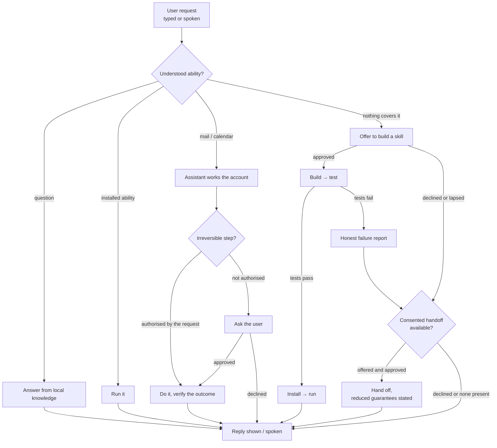
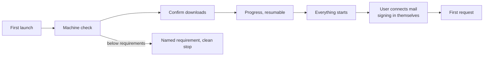

# Jarvis — Requirements

**Status:** draft for review; becomes Chapter 3 of the report. Format follows
the department's convention: requirement-gathering narrative, personas,
MoSCoW-prioritised functional and non-functional requirement tables, use
cases, and user flows. Requirements state **what the user can do and what the
system must guarantee** — how any of it is achieved belongs to the Design
chapter, not here.

## 3.1 Problem statement

Capable AI assistants exist, but the ones available to consumers are
cloud-hosted: whatever the user asks — their email, their calendar, their
files — leaves their machine. Assistants that do run locally exist as
developer tools: they require command-line installation, manual model
management, and constant configuration, placing them out of reach of the
people who would benefit most. And in either form, today's assistants have a
fixed repertoire: a request outside it simply fails, or worse, is attempted
badly and reported as done.

There is a need for a personal assistant that a non-technical person can
install and operate on their own computer, that keeps every piece of their
data on that computer, that handles the everyday load of email and calendar,
that can safely *extend its own abilities* when asked for something new — and
that never takes an irreversible action, or installs code into itself, without
the user's knowledge and consent.

## 3.2 Requirement gathering

Direct stakeholder interviews were not feasible; requirements were derived
from four sources:

- **The project brief.** The supervisors' proposal specifies the pillars: a
  locally-run, privacy-first assistant; autonomous skill generation in
  response to novel requests; asynchronous access through a familiar
  messaging channel; and evaluation of latency, task success, and the
  security of sandboxed execution.
- **Measured behaviour of an existing agent runtime.** A pilot study run for
  this project (Chapter 5) drove a mature open-source agent framework with
  local models on consumer hardware. Its failure modes — actions reported
  done that never happened, uncontrolled tool use, self-written capabilities
  installed without testing — directly motivate the honesty, consent, and
  verification requirements below.
- **Community evidence.** Published community guidance on running agent
  frameworks against local models corroborates the pilot: reliable operation
  is generally reported only with far larger models than consumer hardware
  can serve, reinforcing the need for a system designed around small-model
  limits rather than assuming them away.
- **Scenario analysis.** Personas and scenarios (§3.2.1) were mapped against
  the everyday tasks a personal assistant is expected to carry: correspondence,
  scheduling, file chores, and repeated ad-hoc requests.

### 3.2.1 Personas

| | **Maya Okafor** |
|---|---|
| Role | Self-employed accountant, 52 |
| Background | Runs her practice from a MacBook; competent with ordinary applications, has never used a terminal. Client correspondence is confidential by professional obligation. |
| Responsibilities | Managing a high volume of client email, deadlines and appointments; safeguarding client financial data. |
| Challenges | Maya would benefit most from an assistant, but every capable one she has tried requires sending client data to a third-party service, which she cannot justify professionally. Local alternatives assume technical skill she does not have and does not want to acquire. She needs installation and daily use to feel like any other Mac application, and she needs certainty that nothing she asks ever leaves her machine. |

| | **Dev Sharma** |
|---|---|
| Role | MSc student, 24 |
| Background | Technically literate; comfortable trying new software; time-poor. |
| Responsibilities | Coursework deadlines, supervisor correspondence, part-time work scheduling. |
| Challenges | Dev's questions are small but constant — "did the department reply about my extension?", "what's on Friday?" — and each one costs a context switch into webmail. He wants them answered conversationally, ideally by voice while doing something else, and wants repeated chores to get faster rather than cost the same effort every time. |

| | **Ines Almeida** |
|---|---|
| Role | Software developer, 34 |
| Background | Builds backend systems professionally; security-conscious by habit and by trade. |
| Responsibilities | Evaluating tools before trusting them with real data. |
| Challenges | Ines's default stance toward an agent that can act on her machine is distrust. She will not use an assistant that acts invisibly: she wants to see what it is doing while it does it, review what any self-installed ability is permitted to touch, veto anything irreversible, and verify — not be told — that claimed outcomes really happened. |

**Scenario.** Maya asks the assistant whether a client has replied about a
filing deadline; it answers from her own mailbox, on her own machine, in
seconds. She then asks it to rename three hundred scanned receipts by date —
something it has never done before. It tells her it doesn't yet have that
ability, describes what it would build and what that ability would be allowed
to access, and asks permission. She approves; a minute later the receipts are
renamed, and the ability remains for next quarter. Ines, watching the same
flow, can open the activity view mid-task, read the new ability's permissions,
and delete it afterwards if she chooses.

### 3.2.2 MoSCoW table

| ID | Functional Requirement | Priority |
|---|---|---|
| F1 | The application shall allow the user to install and set it up without any command-line interaction | MUST |
| F2 | The application shall allow the user to make requests in natural language through a chat interface | MUST |
| F3 | The application shall allow the user to speak requests aloud and hear spoken replies | MUST |
| F4 | The application shall allow the user to read, search and summarise email from their own account | MUST |
| F5 | The application shall allow the user to draft, reply to and send email from their own account | MUST |
| F6 | The application shall allow the user to ask what is on their calendar | MUST |
| F7 | The application shall not take an irreversible action unless the user's request authorised it or the user explicitly approves it when asked | MUST |
| F8 | The application shall offer to build a new skill when a request is beyond its abilities — stating what it would do and what it would be permitted to access — and shall proceed only with the user's explicit approval | MUST |
| F9 | The application shall test every skill it builds and shall install only those that pass | MUST |
| F10 | The application shall show the user every ability it has, including what each is permitted to access | MUST |
| F11 | The application shall allow the user to remove any learned ability | MUST |
| F12 | The application shall show the user what it is doing while it works | MUST |
| F13 | The application shall report outcomes from verified results and shall report failures as failures | MUST |
| F14 | The application shall not enter, store or ask for the user's passwords or payment details, and shall hand control to the user at any sign-in | MUST |
| F32 | The application shall retain the skills it has installed and use them to fulfil later matching requests | MUST |
| F15 | The application shall allow the user to choose which locally-installed models it uses | SHOULD |
| F17 | The application shall allow the user to view its learned web routines and remove them | SHOULD |
| F18 | The application shall allow the user to review past skill-building attempts, including failed ones | SHOULD |
| F19 | The application shall allow the user to view measurements of its own performance | SHOULD |
| F20 | The application shall allow the user to have appointments and events booked into their calendar — either as requested directly, or from details the application finds in their email — subject to the same approval rules as any other irreversible action (F7) | SHOULD |
| F28 | The application shall allow a request beyond its own abilities to be handed to other agent software on the user's machine, only with the user's explicit approval and with the handoff's reduced guarantees stated | SHOULD |
| F29 | The application shall allow the user to reach the full interface of the other agent software directly from the application, and shall make clear that the application's guarantees end at that boundary | SHOULD |
| F21 | The application shall allow the user to interact with it from their phone | COULD |
| F22 | The application shall allow the user to make quick requests without opening the main window | COULD |
| F23 | The application shall allow the user to browse their past conversations | COULD |
| F24 | The application shall allow the user to share a skill it has built with another installation | COULD |
| F16 | The application shall make skills it has built usable by other agent software on the user's machine | COULD |
| F30 | The application shall ensure that skills it shares with other agent software keep their access restrictions and integrity checks when run there | COULD |
| F31 | The application shall allow its skill-building ability to be invoked from within other agent software on the user's machine, with the request routed through the application's own consent and testing pipeline | COULD |
| F25 | The application shall automate websites beyond the user's mail and calendar | WON'T |
| F26 | The application shall run on platforms other than Apple-silicon macOS | WON'T |
| F27 | The application shall support multiple users on one installation | WON'T |

| ID | Non-Functional Requirement | Priority |
|---|---|---|
| NF1 | The application shall keep the user's data, and all processing of it, on the user's machine, and shall not transmit it to any third-party service; where the user explicitly connects a messaging channel or asks for a web search, only the content of that exchange leaves the machine, and the application shall disclose that it does | MUST |
| NF2 | The application shall not allow content it encounters while working — a webpage, an email, a document — to authorise actions | MUST |
| NF3 | The application shall be usable by a first-time, non-technical user without documentation | MUST |
| NF4 | The application shall operate fully on a consumer machine with 24 GB of unified memory | MUST |
| NF5 | The application shall acknowledge every request within three seconds, answer routine questions within one minute, and complete typical mail tasks within two | MUST |
| NF6 | The application shall recover from interruption gracefully | SHOULD |
| NF7 | The application shall become faster at tasks it has learned from performing before | SHOULD |
| NF8 | The application shall be accompanied by documented code, a system manual and a user manual | MUST |

**Scope remarks.** *Terminology:* an **ability** is anything the application
can do on request; its two learned kinds are **skills** (built programs) and
**web routines** (learned interaction sequences). Rows use the specific word
where the distinction matters. F25 is excluded on evidence rather than
preference: the pilot measured the baseline runtime at 1/7 on general web
tasks with local models, and community guidance places reliable agentic
browsing at model sizes beyond consumer hardware; mail and calendar (F4–F6)
remain in scope. F21 remains a pillar of the project brief and is held at
COULD not for difficulty — it is an inexpensive extension of the same request
pipeline over a messaging transport — but because the first release's
capacity is committed to the MUSTs; it is first in line afterwards. The
prohibitions are deliberately MUSTs rather than WON'Ts: F7, F14 and NF1 are
binding properties of every release, not features deferred from this one.
F28–F31 govern coexistence with other agent software on the same machine:
when a request is beyond the application's abilities, building a skill (F8)
is offered first and the handoff (F28) is the consented fallback; the user
may also step through the boundary entirely (F29); and skills cross it only
as one deliverable with their safeguards (F16 with F30) — in every case the
boundary is stated, never blurred.

## 3.3 Use cases

| ID | Actor | Goal | Requirements |
|---|---|---|---|
| UC1 | Maya | Install the assistant and reach a first successful answer | F1, F2, NF3 |
| UC2 | Dev | Ask, by voice, whether someone has replied | F3, F4, F13 |
| UC3 | Dev | Send a reply by voice | F3, F5, F7, F13 |
| UC4 | Maya | Ask for something new; approve the skill the assistant offers to build | F8, F9, F10 |
| UC5 | Dev | Repeat a previously learned task and see it complete faster | F32, NF7 |
| UC6 | Ines | Inspect an ability's permissions and past build attempts; remove it | F10, F11, F18 |
| UC7 | Ines | Watch the assistant work; review its performance measurements | F12, F19 |
| UC8 | Maya | Reach a login wall and take over herself | F14 |
| UC9 | Dev | Ask from his phone | F21 |
| UC10 | Maya | Have an appointment from an email put on her calendar | F20, F7, F13 |
| UC11 | Ines | Step through to the other agent software's full interface, knowingly | F29 |

### UC1 — First run to first answer
*Precondition:* installer obtained; clean machine. *Trigger:* first launch.
1. The assistant checks the machine meets its needs and says what it will download and why.
2. The user accepts the defaults; downloads proceed with visible progress and survive interruption.
3. Everything needed starts without further action; the assistant invites a first request.
4. The user asks a question and receives an answer.
*Error paths:* machine below requirements → the missing requirement is named and setup stops cleanly; interrupted download → resumes on next launch.

### UC3 — Send a reply by voice
*Precondition:* the user has connected their mail account (F14: by signing in themselves). *Trigger:* the user says "reply to `<address>` saying I'll be there at nine."
1. The transcript is shown; the activity view narrates the steps (F12).
2. Because the spoken request itself asks for a reply, sending is authorised without a second prompt (F7).
3. The outcome is confirmed from the mailbox itself, and spoken back (F13).
*Variant:* "draft…" → composed but never sent, and the user is told where it is.
*Error path:* the named person is ambiguous in this mailbox → the assistant declines to guess, lists the candidates, and sends nothing.

### UC4 — Approve a new skill
*Trigger:* "rename all the receipts in this folder by their dates."
1. No installed ability covers it; the assistant offers to build one, stating what it would do, what it would be allowed to access, and roughly how long it will take (F8).
2. The user approves; progress and test results stream in the activity view (F12).
3. Tests pass → the skill is installed, run, and the result presented; it now appears among the user's abilities with its origin recorded (F9, F10).
4. Had the user declined, nothing would have been created, and the offer lapses on its own (F8).
*Error path:* attempts exhaust without passing tests → an honest failure with the reason; nothing is installed (F9, F13).

## 3.4 User flows

### Request flow (every interaction takes this path)

### First-run flow

### Voice flow

## 3.5 Verification mapping (feeds Chapter 5)

| Requirement(s) | Verified by |
|---|---|
| F2, F3 | Every protocol run is driven through the chat interface; voice is exercised by the UAT script and the installation smoke pass |
| F4–F7, F13 | Task suite A of the evaluation protocol, outcomes checked against the mailbox and calendar themselves (calendar case A8) |
| NF5 | Per-run acknowledgement (TTA) and completion (TTC) times against the stated bounds; "routine questions" and "typical mail tasks" are operationalised as Suite A's read and write cases |
| F20 | Registered as Phase-2 verification (booking cases in the next protocol revision); a pre-submission stretch build ships feature-only |
| F8, F9 | Consent tests (automated); skill-generation suite C with damage rate |
| F32 | Suite C's reuse-latency measure and repeat-cost suite E |
| F28, F29 | Consent tests (automated) pin that handoff is offered, never assumed, and that the reduced-guarantees statement is shown; the marked door — including its disabled state on a machine without the other software — is checked in the installation smoke pass |
| F7, F14, NF2 | Safety suite D, including the credential-refusal scenario (D7) and the adversarial page scenario; the sign-in handoff is exercised by onboarding and checked in the smoke pass |
| F10–F12, F15, F17, F18 | Installation smoke pass and the UAT script: abilities view (permissions, removal, past attempts and web routines), live activity view, model settings |
| F19 | The in-app benchmarks page fed from the frozen results; its cut, if taken, is a logged scope decision |
| NF7 | Repeat-cost suite E |
| F1, NF3 | Scripted clean-machine installation; UAT (n ≥ 4) with SUS |
| NF1 | Network egress log captured across the full demo script |
| NF4 | Existing memory-residency measurements |
| NF6 | The protocol's false-success-rate metric: any failed or unfinished action presented as complete counts against it (with F13) |
| NF8 | The manuals and documented code are themselves the evidence, submitted with the report |

## 3.6 Decisions log

- 2026-08-09 — Phone access (F21) held at COULD.
- 2026-08-09 — General web automation excluded (F25) on measured and
  community evidence, recorded in §3.2.2's scope remarks.
- 2026-08-09 — Requirements rewritten solution-agnostically; all
  implementation nouns moved out of this chapter.
- 2026-08-09 — Requirements restated in the department's convention: every row
  "the application shall / shall not", prohibitions promoted from WON'T to
  binding MUSTs, non-functional categories removed.
- 2026-08-09 — Calendar booking added (F20, SHOULD): events booked on request
  or from details found in email, behind the F7 approval rules; scheduled at the
  top of Phase 2 with a gated week-4 stretch slot.
- 2026-08-09 — Delegation requirement added (F28, SHOULD) with a stable
  ID appended out of sequence: consented handoff to the general executor,
  implemented and test-pinned the same day. IDs are identifiers, not positions.
- 2026-08-09 — Full OpenClaw access is by marked link to its own dashboard
  (week 2), not by embedding: artifact-level guarantees (sandbox, integrity)
  travel with exported skills; pipeline-level guarantees (mandates,
  verification, consent) apply only inside Jarvis, and the UI boundary keeps
  that legible.
- 2026-08-09 — The coexistence decision completed as requirements: full-
  interface access (F29, SHOULD — in-scope, week 2), safeguards travelling
  with shared skills (F30, COULD) and skill-building invocable from the other
  side (F31, COULD) — the latter two are the Phase 5 exporter.
- 2026-08-09 — Adversarial review round (two independent reviewers plus an
  author pass) closed against this chapter, the plan, and the protocol.
  Evidence restored where the Suite-B demotion had silently orphaned two
  MUSTs: the credential-refusal test moved into Suite D (D7, for F14) and a
  calendar-read case registered (A8, for F6); the verification mapping now
  covers every MUST, and F20's row is restated as Phase-2 verification (a
  stretch build ships feature-only).
- 2026-08-09 — Wording and priority corrections from the same round: F8 gains
  its disclosure clause (what the skill would do and touch — already the
  scenario's promise); F32 added as a MUST (retain and reuse installed
  skills — the flow and UC5 always assumed it); NF1 gains the
  connected-channel disclosure the architecture chapter already recorded;
  NF5 given numeric bounds; NF6's duplicate honesty clause yielded to F13;
  NF8 promoted to MUST to match the plan's non-droppable manuals; F16
  demoted to COULD and fused with F30 as one Phase-5 deliverable; the
  request flow gains the F28 handoff branch, offered after building is
  declined or fails.
